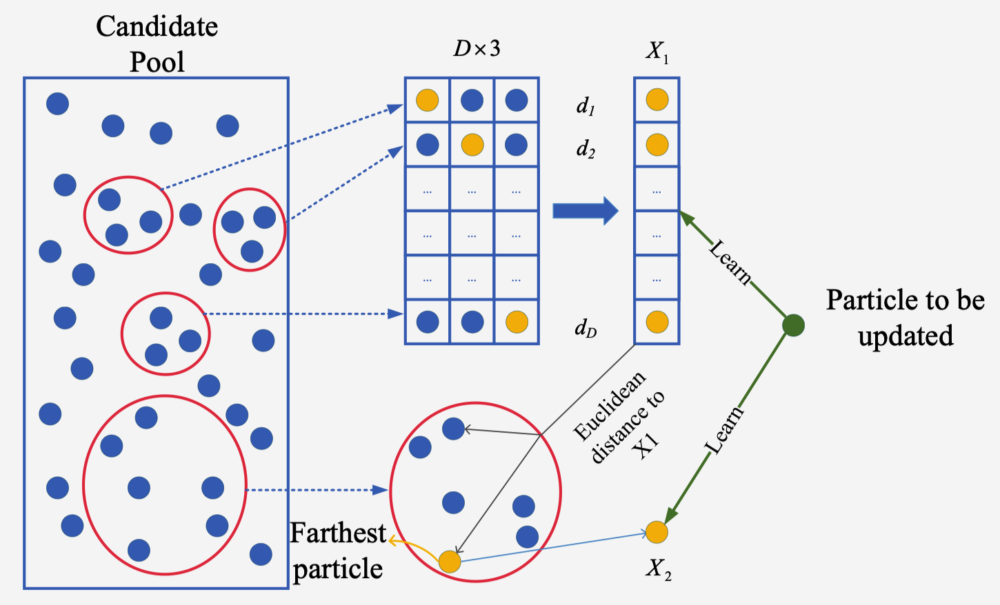
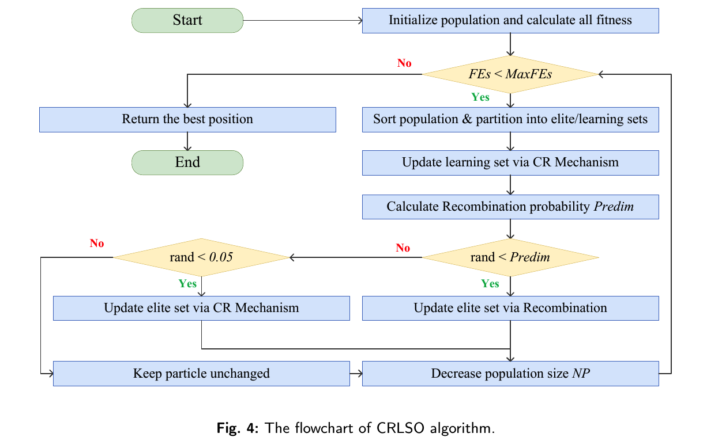
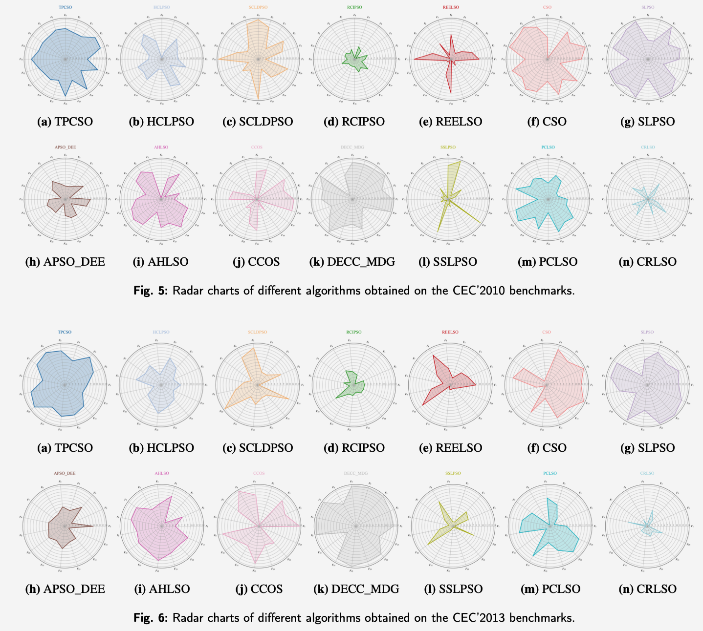
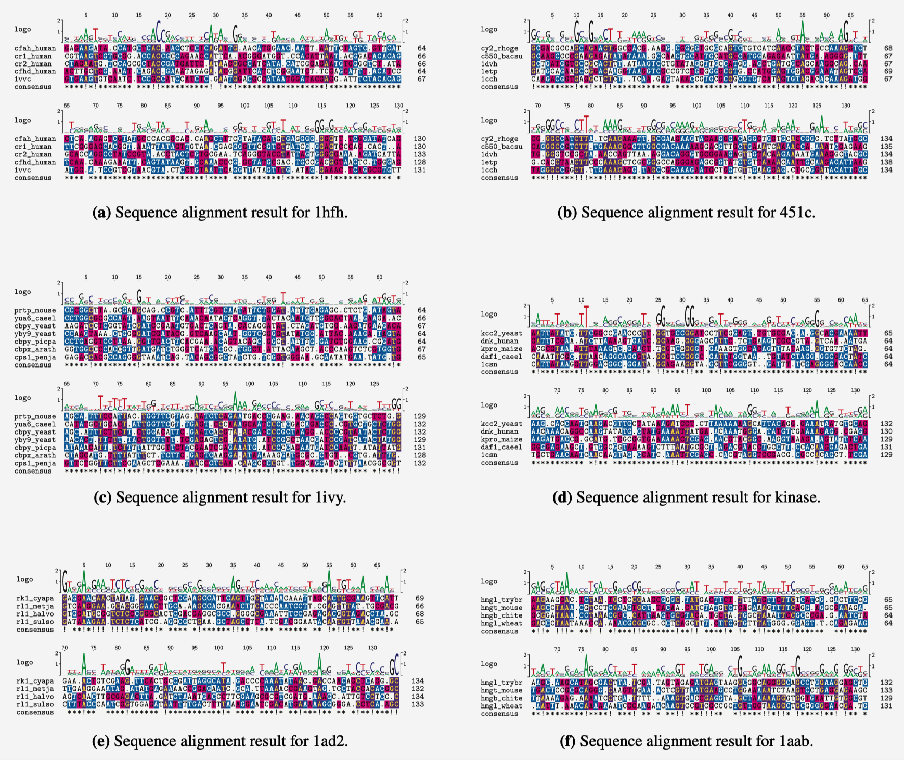

## CRLSO: A Competitive Recombination Learning Swarm Optimizer for Large-scale Global Optimization

<p align="left">
  
  
  
</p>


 **Authors**
```
Guanghui Zhou, Qingke Zhang*, Kaitong Fu, Xingchen Dong, Junqing Li, Diego Oliva
```
>  1. School of Computer Science and Artificial Intelligence, Shandong Normal University, Jinan 250358, China  
>  2. School of Mathematics, Yunnan Normal University, Kunming 650500, China  
>  3. Depto. de Ingeniería Electro-Fótonca, Universidad de Guadalajara, CUCEI, 44430, Guadalajara, México  

> **Corresponding author:** Qingke Zhang   
> **Email:** `tsingke@sdnu.edu.cn`

**Copyright**
```
 This repository contains the official implementation of our research work

which has been submitted to Elsevier Journal "Knowledge-Based Systems (KBS)".

Copyright © 2026 by the authors. All rights reserved.
```
---

## 1. Research Overview

CRLSO is proposed for large-scale global optimization, where high dimensionality, strong variable interactions, and rapid diversity loss often degrade the search performance of conventional swarm optimizers. The method is built on a fitness-stratified learning framework that organizes the population into different search roles and coordinates exploration and exploitation more effectively. For learning particles, CRLSO constructs a high-quality recombinant exemplar through dimension-wise competition among superior candidates, while introducing a contrastive exemplar to provide directionally distinct guidance and enhance the ability to escape local optima. For elite particles, a dynamically scheduled dimensional recombination strategy is employed to strengthen late-stage refinement without destroying promising solution structures. In addition, a linear population reduction mechanism is incorporated to improve the utilization efficiency of function evaluations during the search process. Experimental studies on standard CEC large-scale benchmark suites and a Profile-HMM-based multiple sequence alignment task show that CRLSO achieves strong competitiveness, robust convergence behavior, and promising practical applicability. The source code is available at [https://github.com/tsingke/CRLSO](https://github.com/tsingke/CRLSO).

## 2. Repository Structure

```text
CRLSO/
├── CRLSO.m                         # Main MATLAB implementation
├── LICENSE                         # License file
├── README.md                       # Project homepage
├── Diagrams/                       # Pictures of CRLSO
├── Benchmark/                      # Benchmark functions
├── Experiments/                    # Experiment information 
└── Results/                        # Saved results and plots
```

## 3. Schematic Diagram 


<p align="left">
  
  
</p>
<p align="center">
  Illustration of CRLSO learning and flowchart.
</p>


<p align="left">
  
</p>
<p align="center">
  Search Behavior Analysius.
</p>

<p align="left">
  
</p>
<p align="center">
 Peformance Comparison with Radar charts on CEC'2010 and CEC'2013.
</p>

<p align="left">
  
</p>
<p align="center">
 CRLSO for Multiple Sequence Alignment(MSA).
</p>
## 4. MATLAB Implementation


```matlab

% =========================================================================
%  CRLSO: Competitive Recombination Learning Swarm Optimizer (for LSGO)
%  Copyright (c) 2026, Qingke Zhang @ SDNU
%  Academic and research use only. Please cite the related paper if used.
% =========================================================================
%
%  Function:
%    [gbestx, bestever, gbesthistory] = CRLSO(popsize, dimension, xmax, ...
%        xmin, vmax, vmin, maxiter, fCalculation, FuncId)
%
%  Inputs:
%    popsize       - Input population size.
%    dimension     - Dimensionality of the optimization problem.
%    xmax          - Upper bound of decision variables.
%    xmin          - Lower bound of decision variables.
%    vmax          - Upper bound of particle velocities.
%    vmin          - Lower bound of particle velocities.
%    maxiter       - Reserved iteration argument.
%    fCalculation  - Fitness function handle.
%    FuncId        - Problem or benchmark identifier.
%
%  Outputs:
%    gbestx        - Best solution found by CRLSO.
%    bestever      - Best objective value obtained during the search.
%    gbesthistory  - Best-so-far fitness history over function evaluations.
% --------------------------------------------------------------------------
function [gbestx, bestever, gbesthistory] = CRLSO(popsize, dimension, xmax, xmin, vmax, vmin, maxiter, fCalculation, FuncId)

% ---- default configuration ----
MaxFEs = 3e6;
NP_max = 800;
NP_min = round(0.1 * NP_max);
NP = NP_max;

elite_ratio = 0.25;
phi = 0.4;
subset_size = 10;
P_elite_update_base = 0.05;
redim_rate = 0.1;
P_redim_initial = 0.05;
P_redim_final = 0.5;

% ---- initialization ----
p = xmin + (xmax - xmin) .* rand(NP_max, dimension);
v = vmin + (vmax - vmin) .* rand(NP_max, dimension);
fitness = zeros(NP_max, 1);

for i = 1:NP_max
    fitness(i) = ComputeFitness(p(i, :)', FuncId);
end

FEs = NP_max;
[bestever, id] = min(fitness);
gbestx = p(id, :);
gbesthistory = bestever * ones(MaxFEs, 1);

% ---- main loop ----
while FEs <= MaxFEs
    [fitness(1:NP), idx] = sort(fitness(1:NP), 'ascend');
    p(1:NP, :) = p(idx, :);
    v(1:NP, :) = v(idx, :);

    elite_count = max(2, floor(NP * elite_ratio));
    learning_indices = elite_count + 1 : NP;

    % ---- learning set ----
    for ii = learning_indices
        [p(ii, :), v(ii, :)] = update_particle(p, v, fitness, ii, elite_count, subset_size, phi, xmin, xmax, vmin, vmax);
        fitness(ii) = ComputeFitness(p(ii, :)', FuncId);
        FEs = FEs + 1;

        if fitness(ii) < bestever
            bestever = fitness(ii);
            gbestx = p(ii, :);
        end
        if FEs <= MaxFEs
            gbesthistory(FEs) = bestever;
        end
        if FEs >= MaxFEs
            break;
        end
    end
    if FEs >= MaxFEs, break; end

    % ---- elite set ----
    P_redim = P_redim_initial + (P_redim_final - P_redim_initial) * (FEs / MaxFEs);

    for ii = 2:elite_count
        if rand < P_redim
            trial = p(ii, :);
            nd = max(1, floor(dimension * redim_rate));
            dims = randperm(dimension, nd);
            donor = randi(ii - 1);
            trial(dims) = p(donor, dims);

            trial_fit = ComputeFitness(trial', FuncId);
            FEs = FEs + 1;

            if trial_fit < fitness(ii)
                p(ii, :) = trial;
                fitness(ii) = trial_fit;
            end
        elseif rand < P_elite_update_base
            [p(ii, :), v(ii, :)] = update_particle(p, v, fitness, ii, ii - 1, subset_size, phi, xmin, xmax, vmin, vmax);
            fitness(ii) = ComputeFitness(p(ii, :)', FuncId);
            FEs = FEs + 1;
        end

        if fitness(ii) < bestever
            bestever = fitness(ii);
            gbestx = p(ii, :);
            gbesthistory(FEs) = bestever;
        end
    end
   
    fprintf('CRLSO, FEs: %d/%d, BestFit: %e\n', FEs, MaxFEs, bestever);

    NP = min(NP, round(NP_max - (NP_max - NP_min) * (FEs / MaxFEs)));
end

% ---- fill tail if needed ----
if FEs < MaxFEs
    gbesthistory(FEs+1:MaxFEs) = bestever;
else
    gbesthistory = gbesthistory(1:MaxFEs);
end
end

%%% update function defination %%%

function [p_new, v_new] = update_particle(p, v, fitness, p_idx, candidate_pool_count, subset_size, phi, xmin, xmax, vmin, vmax)
    if candidate_pool_count < 2
        p_new = p(p_idx, :);
        v_new = v(p_idx, :);
        return;
    end

    Candidate_p = p(1:candidate_pool_count, :);
    Candidate_f = fitness(1:candidate_pool_count);
    D = size(p, 2);

    % ---- recombinant exemplar X_e1 ----
    tournament_idx = randi(candidate_pool_count, [D, 3]);
    tournament_fit = Candidate_f(tournament_idx);
    [~, winner_col] = min(tournament_fit, [], 2);
    linear_idx = sub2ind(size(tournament_idx), (1:D)', winner_col);
    winner_idx = tournament_idx(linear_idx);

    X_e1 = zeros(1, D);
    for d = 1:D
        X_e1(d) = Candidate_p(winner_idx(d), d);
    end

    % ---- contrastive exemplar X_e2 ----
    sampled_idx = randperm(candidate_pool_count, min(candidate_pool_count, subset_size));
    sampled_p = Candidate_p(sampled_idx, :);
    dist = vecnorm(sampled_p - X_e1, 2, 2);
    [~, farthest_id] = max(dist);
    X_e2 = sampled_p(farthest_id, :);

    % ---- velocity / position update ----
    v_new = rand(1, D) .* v(p_idx, :) ...
          + rand(1, D) .* (X_e1 - p(p_idx, :)) ...
          + phi * rand(1, D) .* (X_e2 - p(p_idx, :));

    v_new = min(max(v_new, vmin), vmax);
    p_new = p(p_idx, :) + v_new;
    p_new = min(max(p_new, xmin), xmax);
end
```


## 5. License

This repository is released for **academic research and educational use only**.

- Please cite the related paper when using this code.
- For redistribution, derivative release, or commercial use, please contact the corresponding author.


## 6. Contact

**Prof. Ph.D. Qingke Zhang**  
- **Email**: [tsingke@sdnu.edu.cn](tsingke@sdnu.edu.cn)
- **Wechat:**  [@tsing_ke](https://web1.wechat.com/cgi-bin/mmwebwx-bin/webwxindex?t=v2/index)


## 7. Acknowledgement

**We would like to express our sincere gratitude to editors and the anonymous reviewers for taking the time to review our paper.** 

This work is supported by the National Natural Science Foundation of China (Grant Nos. 62006144) 

If this repository is useful to your research, please consider giving it a **star**.  

Your support helps improve the visibility of this work and promotes further studies on large-scale intelligent optimization.
